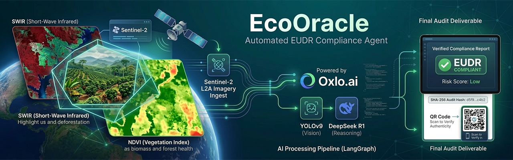
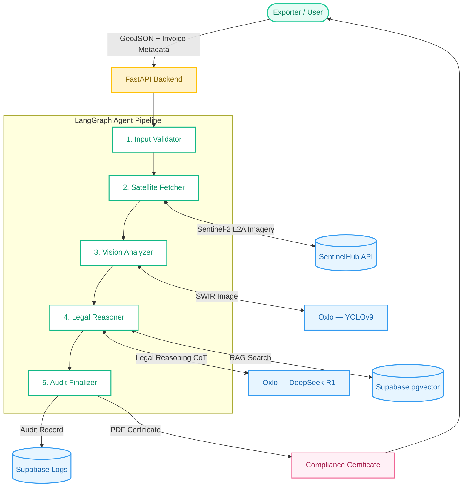
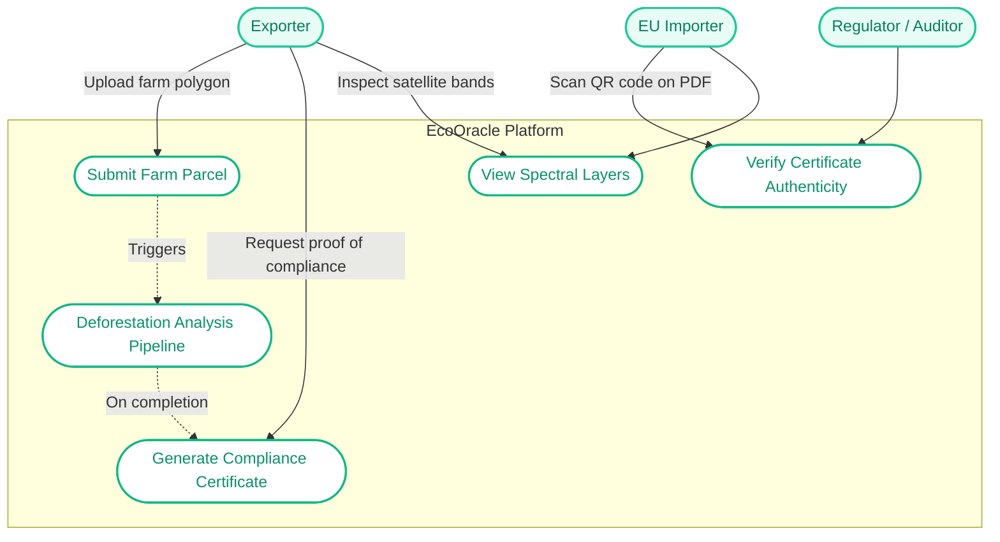
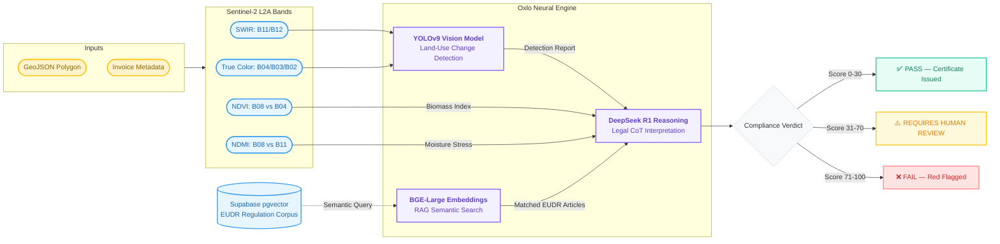

# EcoOracle — Automated EUDR Compliance Agent

**A Strategic AI Infrastructure for Global Trade Compliance**

---

## 1. Executive Summary

EcoOracle is an AI-driven auditing infrastructure designed to solve the most critical trade challenge of 2026: the **European Union Deforestation Regulation (EUDR)**. By leveraging Oxlo.ai's high-performance, request-based inference, EcoOracle transforms raw satellite data and shipping documentation into legally defensible compliance verdicts.

Its mission is to **democratize access to the European market** for global exporters and SMEs by reducing the prohibitive costs of traditional environmental auditing.

---

## 2. The Problem: The "Green Barrier"

As of 2026, EUDR mandates that any company importing coffee, cocoa, rubber, or timber into the EU must prove their products are **"deforestation-free" post-2020**.

- **The Risk:** Non-compliance penalties can reach **4% of a company's annual turnover**.
- **The Gap:** Current satellite monitoring tools provide images but lack the legal reasoning and cost efficiency required for mass-market adoption by small and medium importers.

> [!CAUTION]
> Without a certified due-diligence system, exporters face customs seizure and market exclusion from the EU — one of the world's largest agricultural import markets.

---

## 3. Value Proposition

### Predictable Cost (The Oxlo Edge)
By migrating from "pay-per-token" to Oxlo.ai's request-based pricing, EcoOracle reduces compliance audit costs by **85%**, enabling scalable, high-frequency verification without budget surprises.

### Deep Reasoning Audit
Unlike standard visual monitoring, EcoOracle utilizes **DeepSeek R1** via Oxlo to perform cross-reasoning between billing metadata, GPS coordinates, and Sentinel-2 multi-spectral analysis. It delivers a **technical-legal report** ready for customs authorities.

### Real-Time Verification
Direct integration with the **Copernicus Data Space Ecosystem** ensures that every audit is based on the most recent satellite captures available.

### Zero-Infrastructure Friction
Designed as an "API-first" solution, EcoOracle integrates seamlessly into existing ERPs — moving companies from regulatory uncertainty to guaranteed operations in seconds.

---

## 4. System Architecture

### 4.1 General Architecture

The system follows a **multi-agent orchestration pattern** using LangGraph. Each node specializes in a specific domain of the compliance pipeline.




### 4.2 Use Case Diagram




### 4.3 AI Models & Connectivity Diagram



---

## 5. Technical Architecture Details

### 5.1 Agent Pipeline (LangGraph Nodes)

| Node | File | Responsibility |
| :--- | :--- | :--- |
| `input_validator` | `agents/nodes/input_validator.py` | GeoJSON schema validation, CRS check, polygon area calculation |
| `satellite_fetcher` | `agents/nodes/satellite_fetcher.py` | Multi-spectral band retrieval from SentinelHub, cloud-cover filtering |
| `vision_analyzer` | `agents/nodes/vision_analyzer.py` | Sends SWIR image to Oxlo YOLOv9, parses deforestation detections |
| `legal_reasoner` | `agents/nodes/legal_reasoner.py` | RAG lookup + DeepSeek R1 CoT prompt for compliance verdict |
| `audit_finalizer` | `agents/nodes/audit_finalizer.py` | SHA-256 audit hash, Supabase log write, Base64 image encoding |

### 5.2 Sentinel-2 Spectral Layers

| Priority | Layer | Bands | Role in EcoOracle |
| :--- | :--- | :--- | :--- |
| **Critical** | SWIR | B11, B12 | Primary input for YOLOv9 deforestation detection |
| **Analytical** | NDVI | B08, B04 | Biomass index for the legal reasoning report |
| **Analytical** | NDMI | B08, B11 | Vegetation moisture stress (distinguishes logging from pruning) |
| **Reference** | True Color | B04, B03, B02 | Visual evidence for dashboard and PDF export |

> [!TIP]
> NDMI values below 0.2 combined with low NDVI are strong indicators of forest clearing. EcoOracle uses this threshold to differentiate legal agricultural management from actual deforestation.

### 5.3 Oxlo AI Models

| Model | Role | Why |
| :--- | :--- | :--- |
| **YOLOv9** | Vision — deforestation detection | Processes SWIR imagery for land-use change and suspicious clearing detection |
| **DeepSeek R1** | Reasoning — legal interpretation | Chain-of-Thought reasoning across EUDR Articles 3 and 9, cross-referencing vision outputs and invoice metadata |
| **BGE-Large** | Embeddings — RAG semantic search | 1024-dimension semantic search over the EUDR regulation corpus; provides legally sourced article citations in every audit |

> [!IMPORTANT]
> BGE-Large is what distinguishes EcoOracle from a prototype. Its 1024-dimension embeddings enable precise semantic search over complex legal queries (e.g., "What applies to coffee plots under 4 hectares per Article 3?").

### 5.4 Compliance Certificate

Each completed audit generates:
- A **PDF certificate** with a legally formatted compliance verdict, satellite evidence thumbnails (RGB, NDVI, NDMI), and a cryptographic SHA-256 audit hash.
- A **QR code** embedded in the PDF that links to the live verification portal where importers and regulators can authenticate the certificate.

> [!NOTE]
> Certificate cache is currently in-memory. In production, this should be migrated to Redis for persistence across server restarts.

---

## 6. Business Impact & Roadmap

### Short-Term
Secure supply chains against EU customs fines and non-compliance penalties.

### Mid-Term
Create a **"Green Passport"** data layer for products, increasing their value in the sustainable economy and simplifying due-diligence declarations.

### Future Roadmap
Expansion into **Parametric Insurance**, where EcoOracle's compliance data automatically triggers payouts in case of climate-related supply chain disruptions.

---

## 7. Technology Stack

### Backend
| Layer | Technology | Version |
| :--- | :--- | :--- |
| API Framework | FastAPI + Uvicorn | `>=0.115.0` |
| Agent Orchestration | LangGraph + LangChain Core | `>=1.0.0` |
| Data Validation | Pydantic v2 | `>=2.7.0` |
| HTTP Client | httpx + tenacity | `>=0.27.0` |
| GIS & Satellite | SentinelHub, GeoPandas, Shapely | `>=3.10.0` |
| Database | Supabase (PostgreSQL + pgvector) | `>=2.5.0` |
| Reporting | ReportLab + qrcode | `>=4.0.0` |

### Frontend
| Layer | Technology |
| :--- | :--- |
| Framework | React 18 + Vite |
| UI Components | Mantine UI |
| Animation | Framer Motion |
| Maps | React Leaflet + Leaflet |
| Forms | React Hook Form + Zod |

---

## 8. Configuration

Copy `.env.example` to `.env` and populate the required variables:

```env
# Oxlo AI
OXLO_API_KEY=your_key_here
OXLO_BASE_URL=https://api.oxlo.ai/v1
OXLO_VISION_MODEL=yolov9
OXLO_REASONING_MODEL=deepseek-r1

# SentinelHub (Copernicus)
SENTINELHUB_CLIENT_ID=...
SENTINELHUB_CLIENT_SECRET=...

# Supabase
SUPABASE_URL=...
SUPABASE_SERVICE_KEY=...

# Application
APP_PUBLIC_URL=http://localhost:5173
```

---

## 9. Running the Project

### Backend (Python 3.12+)
```bash
pip install -r requirements.txt
python -m uvicorn main:app --reload
# API available at: http://localhost:8000
```

### Frontend (Node 18+)
```bash
cd ui
npm install
npm run dev
# UI available at: http://localhost:5173
```

---

## 10. Use Case Examples

To test the EcoOracle pipeline with realistic scenarios, three GeoJSON files representing different crops and geographic regions have been provided in the `examples/` directory.

### ✅ PASS (Compliant)
- **File:** `examples/coffee_pass_colombia.geojson`
- **Location:** Pitalito, Huila, Colombia
- **Crop:** Coffee
- **Parameters:**
  - **Harvest Date:** `2026-03-15`
  - **Reported Volume:** `12.5` Metric Tons
  - **Invoice ID:** `INV-COF-2026-001`
- **Expected Result:** The deep reasoning audit confirms no post-2020 deforestation and valid volume coherence (12.5 tons is highly coherent for a ~10 ha plot). A certified PDF is issued.

### ⚠️ REQUIRES HUMAN REVIEW (Anomalies Detected)
- **File:** `examples/cocoa_review_ivory_coast.geojson`
- **Location:** Daloa, Ivory Coast
- **Crop:** Cocoa
- **Parameters:**
  - **Harvest Date:** `2026-02-10`
  - **Reported Volume:** `45.0` Metric Tons
  - **Invoice ID:** `INV-COC-2026-089`
- **Expected Result:** The system flags the invoice for manual review. The reported volume (45 tons) significantly exceeds the expected historical productivity range for a 5 ha cocoa polygon, triggering an automated volume incoherence penalty.

### ❌ FAIL (Non-Compliant)
- **File:** `examples/palm_fail_indonesia.geojson`
- **Location:** Pekanbaru, Riau, Indonesia
- **Crop:** Palm Oil
- **Parameters:**
  - **Harvest Date:** `2026-01-20`
  - **Reported Volume:** `150.0` Metric Tons
  - **Invoice ID:** `INV-PALM-2026-X12`
- **Expected Result:** The vision neural engine detects clear-cutting land-use change post-2020. The legal reasoner classifies this as a strict violation of EUDR Article 3.1, denying market access.

---

*EcoOracle Intelligence*
